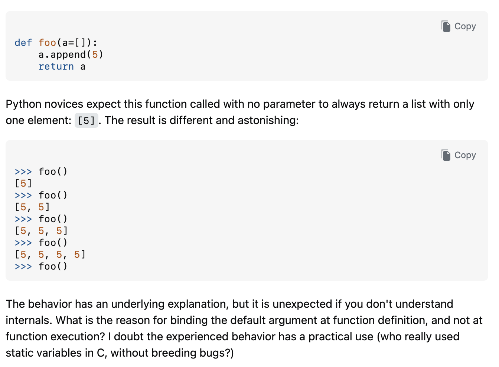
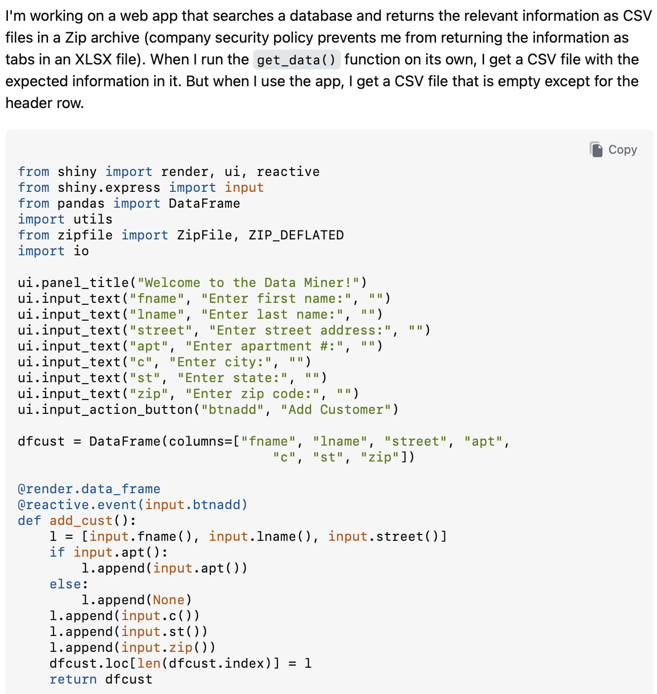
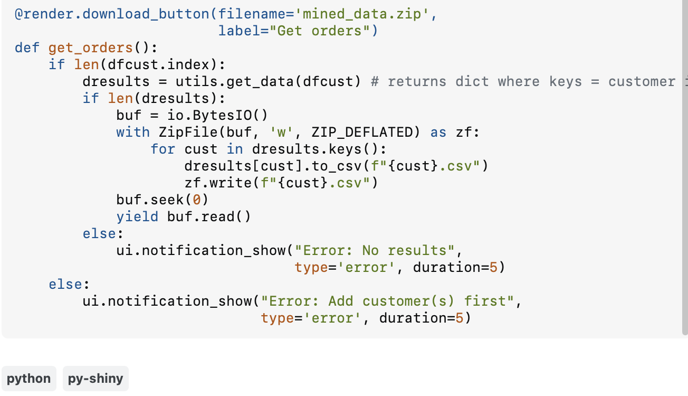

### What is a SMART question?

Have you ever heard the saying there are no dumb questions? Well in programming there are many ways where a question can be bad. Have you ever walked up to a group of people and started joining their conversation just to realize you have no idea what they are talking about? The same applies to coding. We want to provide as much information and context as possible about our code, so developers know where to pinpoint the problem and provide a better solution to the user. When considering code, we try to learn from our previous mistakes and build good habits, so receiving constructive feedback could guide a developer on the right trajectory to developing better habits and writing better code. None of this is possible without having context and finding the part where someone can provide help.

### What makes a SMART question?

Are your questions SMART? Well when considering a SMART question we want to consider whether the readers have enough information about the situation before they proceed on giving an answer. To do this, you should provide things such as what you already tried, so no one suggests the same idea again. Then you have to make sure to have a specific title and description that is unique to your problem, so someone who has never seen your problem before knows what it is about. You also don't want to make someone look through your entire project. Just make sure you have enough of the code to show the problem. Then explain what you're trying to do with the code.

### SMART vs Not SMART Questions

Is this a smart question? Yes of course it is. Why? Well he provided the section of the code that needed to be looked at with nothing extra, which was great. Then he showed the expected and actual output, which prompted him to ask the important question of why this happened. All of these check off the list of being a SMART question, and no surprise he got the answer to solve his issue.

[Least Astonishment and the Mutable Default Argument](https://stackoverflow.com/questions/1132941/least-astonishment-and-the-mutable-default-argument)

Now let's look at an example of a question that falls short.

The description here is actually clear about the symptom, but the code does not let anyone reproduce the problem. The function at the center of the issue, `get_data()`, lives inside an imported `utils` module that is never shown, so no one can run this and see the empty file for themselves. The example also is not minimal. Seven input fields for name, street, apartment, city, state, and zip have nothing to do with a Zip archive coming back empty, which forces a reader to scan the whole program to figure out what matters. The asker also never says what they already tried or how far the data actually gets before disappearing. Cutting this down to the download logic alone would have made it far easier to answer, and might have surfaced the bug on its own.

[Why does my py-shiny web app download an empty file?](https://stackoverflow.com/questions/80002466/why-does-my-py-shiny-web-app-download-an-empty-file)

### Conclusion

I think that everyone can write a SMART question, but it is going to take some adapting and practice because it isn't the same as writing a question in your email. These people have lives too, and we can help them and ourselves by writing SMARTER questions.
