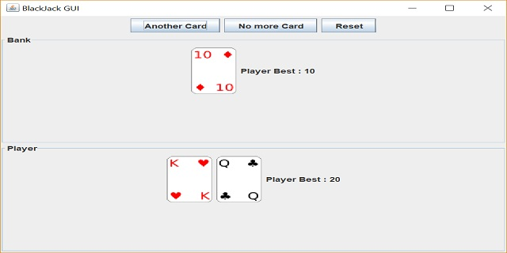

For this project, I incorporated object oriented programming to create a simulation of the game Blackjack through having the Card, Dealer, and Hand classes to operate. The game supports player options such as doubling down, standing, and hitting based on the player's turn. This game serves as practice for users wanting to gamble in casinos without the need to input money. 
