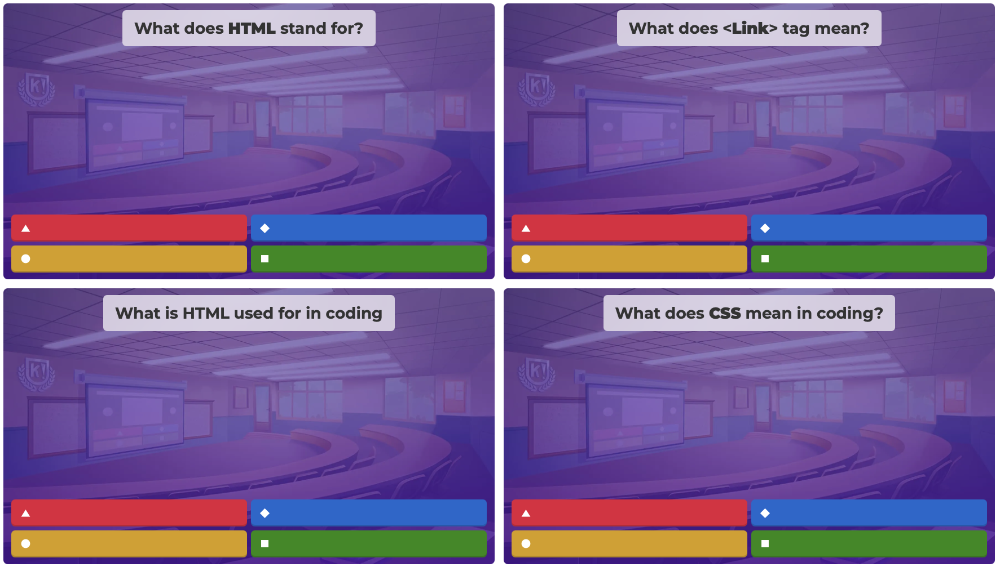

For the class, I designed a curriculum involving learning basic HTML and CSS syntax through W3schools. I helped students memorize these terms by creating Kahoots and study guides. After students became familiar with the syntax we moved on to VS Code, where students applied their knowledge to design their own personal page using HTML and CSS.
