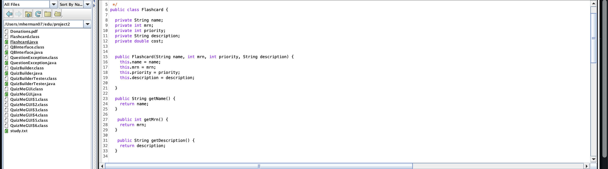

For this project, I incorporated object oriented programming to create a flashcard application allowing users to create, delete, or edit flashcards that can be stored for future uses. The app also consists of loading, ordering, and tracking the progress of the cards as well. 
